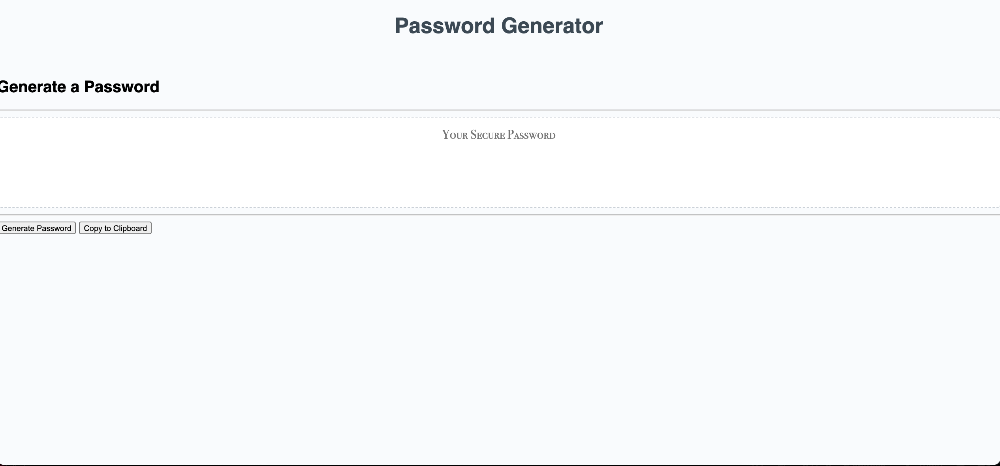

In this Assignment, I was tasked with creating a random password generator.
to achieve this we created an HTML skeleton  and then went about to create the classes and used the CSS and JS to improve on functionality.

